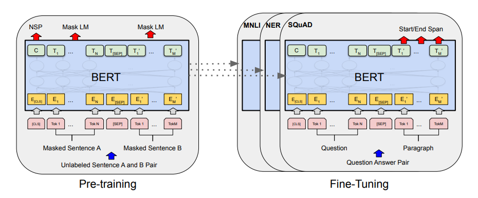

## BERT: Pre-training of Deep Bidirectional Transformers for Language Understanding in Tensorflow
Tensorflow implementation of [BERT: Pre-training of Deep Bidirectional Transformers for Language Understanding](https://arxiv.org/abs/1810.04805)

## Prerequisities
* python 3.8
* tensorflow 2.4
* numpy
* absl
